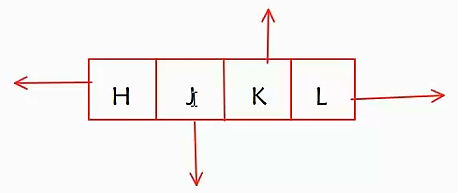

vim 移动:



快捷键:

- Shift + zz: 命令模式下保存并退出
- gg=G: 代码自动对齐
- gg: 定位行首
- G: 定位行尾
- 行号+G: 定位某一行a
- Ctrl + S: 锁住屏幕
- Ctrl + Q: 解锁屏幕

--------------------------------------------------

### 命令模式下相关操作

删除:

- 删除整个单词: dw(delete word) 会删除光标之后的字符串, 光标应该在字符的最前面 
- 删除前半行: d0
- 删除后半行: D
- 删除整行: dd
- 删除3行: 3dd, 从光标位置向下数3行
- 删除光标之后的所有: dG
- 删除光标之前的所有: dgg

--------------------------------------------------

撤销;

- 插销: u
- 反撤销: ctrl + r


--------------------------------------------------

复制粘贴:

- 复制光标当前行: yy
- 粘贴: p 当前位置的下一行， P 当前位置的上一行
- 复制3行: 3yy
- 复制区域: 按v进入可视模式，移动光标进行选择，按y复制，按p粘贴到光标的后面，P前面。

--------------------------------------------------


查找

- 命令模式下输入: / 或 ?   下一个 n, 上一个 N
- / 从光标以下开始搜, ? 从光标以上开始搜
- 命令模式下，光标移动到待搜索的关键字上，输入#


查找系统函数定义: 光标移动到 函数名上，章节号 + K

章节号: man man 里查看

```
1   Executable programs or shell commands
2   System calls (functions provided by the kernel)
3   Library calls (functions within program libraries)
4   Special files (usually found in /dev)
5   File formats and conventions, e.g. /etc/passwd
6   Games
7   Miscellaneous (including macro packages and conventions), e.g. man(7), groff(7)
8   System administration commands (usually only for root)
9   Kernel routines [Non standard]
```

-------------------------------------------------------

### 命令模式切换到编辑模式

- a: 从光标的后面开始输入
- i: 从光标的前面开始输入
- o: 在光标所在上的下一行插入一行进行输入
- O: 在光标所在上的上一行插入一行进行输入
- A: 把光标移动到行尾进行输入
- I: 把光标移动到行首进行输入


-------------------------------------------------------
### 命令模式切换到末行模式

输入 `:`

替换:

- 替换当前行的字符串: s/old/new
- 替换当前行所有: s/old/new/g
- 替换当前行所有, 但是要我一个个确认: s/old/new/gc
- 替换一个范围内的: 开始行号,结束行号s/old/new/g
- 当前文档内的所有: %s/old/new/g


vim 分屏

- `:sp`, 分割线是水平的
- `:vsp`. 分割线是垂直的, 多次使用分多个
- ctrl + w + w, 切屏
- `:q`, 退出一个分屏
- `:qall`, 退出所有分屏
- `:w`，保存 :wall 保存所有
- `:vsp filenmae`, 打开filename
- 打开时直接就分屏: 

	- `vim -o filename filename filename`：水平分屏
	- `vim -O filename filename filename`：垂直分屏


末行模式下执行shell命令

`!shell command`

-------------------------------------------------------

### vim 配置

- 用户级別: 当前用户适用, ~/.vimrc
- 系统级别: 所有用户适用, /etc/vim/vimrc

我现在所用的vim配置

```sh
"设置背景色，每种配色有两种方案，一个light、一个dark
set background=dark
"打开语法高亮
syntax on
set nu  
"没有保存或文件只读时弹出确认
"set confirm
"tab缩进
set tabstop=4
set shiftwidth=4
set expandtab
set smarttab
"文件自动检测外部更改
set autoread   
"c文件自动缩进
set cindent
"自动对齐
set autoindent
"智能缩进
set smartindent
"高亮查找匹配
set hlsearch
"显示标尺，就是在右下角显示光标位置
set ruler
"去除vi的一致性
"不要闪烁
set novisualbell

"启动显示状态行
"set laststatus=2

"浅色显示当前行
"autocmd InsertLeave * se nocul

"用浅色高亮当前行
"autocmd InsertEnter * se cul

"显示输入的命令
set showcmd
colorscheme elflord
"设置字体和大小
set guifont=Consolas:h12
set guifontwide=Microsoft\ YaHei:h12
set encoding=utf-8

"设置文件编码"
set fileencodings=utf-8

"设置终端编码"
set termencoding=utf-8

"设置语言编码"
set langmenu=zh_CN.UTF-8
set helplang=cn
"新建.py,.cc,.sh,.java文件，自动插入文件头"
autocmd BufNewFile *.cpp,*.c,*.sh exec ":call SetTitle()"
    "定义函数SetTitle，自动插入文件头"
func SetTitle()
    if expand ("%:e") == 'sh'
    call setline(1, "#!/bin/bash")
    call setline(2, "#Author: yiouejv")
    call setline(3, "#Email: yiouejv@126.com")
    call setline(4, "#Time: ".strftime("%F %T"))
    call setline(5, "#Name: ".expand("%"))
    else
    call setline(1, "/*")
    call setline(2, " *Author: yiouejv")
    call setline(3, " *Email: yiouejv@126.com")
    call setline(4, " *Time: ".strftime("%F %T"))
    call setline(5, " *Name: ".expand("%"))
    call setline(6, "*/")
    call setline(7, "#include<iostream>")
    endif
endfunc
"激活折叠功能"
set foldenable
set fdm=syntax
```

代码折叠功能:

- zo: 对于当前折叠，打开
- zc: 对于当前折叠，折叠当前的代码
- zR: 打开所有嵌套的折叠
- zM: 折叠所有可嵌套的代码
- zr: 打开最外层的折叠
- zm: 折叠最里层的代码


