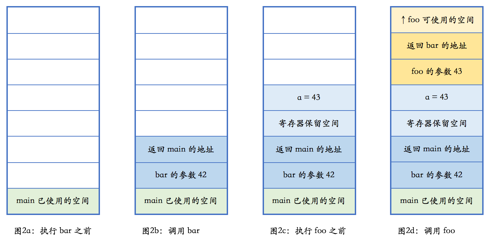

**堆**英文名称 heap, 在内存管理的语境下，指的是动态分配的内存空间，这个和数据结构的堆是两回事。

这里的内存，被分配之后需要手动释放，否则会引发内存泄漏。

那怎么申请一个堆内存空间呢？

C语言中使用`void* malloc(size_t size)`来申请一块内存空间，size为申请的字节数。 使用`void free( void* ptr )` 来手动释放内存。

C++则使用 `new` 和 `delete` 来申请释放内存。

C++标准里一个相关概念是自由存储区，英文是free store，特指使用 new 和 delete 来分配和释放内存的区域。 一般而言，这是堆的一个子集。

**为什么有了 malloc, free, C++中还出现了 new, delete 呢？**

实际上 new, delete 的底层实现是 malloc, free; malloc 只是单纯是申请一块内存空间，但是new不一样，C++中包含面向对象的设计，当我们在new一个对象时，C++不仅要向系统申请一块内存，还需要构造这个对象，调用构造函数，而delete时，则需要调用类的析构函数，然后归回内存空间。

实际上new的操作类似于这样:

```cpp
T* p;
void* mem = operator new(sizeof(T));  // 分配内存，其内部调用malloc
try {
    p = static_cast<T*>(mem);  // 类型转换
    p->T::T( ... );  // 调用构造函数
    return p;
}
catch ( ... ){
    operator delete(p);
    throw;
}
```

如果申请内存成功，并且调用构造函数正常，则对象构造成功，否则释放申请的内存, 抛出 `bad_alloc` 异常。

而 delete 的操作类似于这样:

```cpp
p->T::~T();  // 调用析构函数
operator delete(p);  // 释放内存，内部调用 free
```

先调用析构函数，再释放内存，如果反过来，先释放内存就没办法调用析构函数了嘛？ 是不是？

-------------------------------------

**栈** 英文名称 stack, 在内存管理的语境下，指的是函数调用过程中产生的本地变量和调用数据的区域。 这个栈和数据结构里的栈高度相似，都满足后进先出（last-in-first-out 或 LIFO）。

我们先来看一段示例代码，来说明 C++ 里函数调用、本地变量是如何使用栈的。当然，这一过程取决于计算机的实际架构，具体细节可能有所不同，但原理上都是相通的，都会使用一个后进先出的结构。

```cpp
void foo(int n)
{

}
void bar(int n){
    int a = n + 1;
    foo(a);
}
int main(){
    bar(42);
}
```



生长方向: 栈是朝着地址减小的方向生长的，而堆是朝着地址增大的方向生长的。

当函数调用另外一个函数时，会把参数也压入栈里然后把下一行汇编指令的地址压入栈，并跳转到新的函数。 新的函数进入后，首先做一些必须的保存工作，然后会调整栈指针，分配出本地变量所需的空间，随后执行函数中的代码，并在执行完毕之后，根据调用者压入栈的地址，返回到调用者未执行的代码中继续执行。

本地变量就保存在栈上，当函数执行完成之后，保存本地变量的栈内存就被释放掉了。 

上述例子中本地变量是一般的类型，本地变量不光可以是一般的类型，还可以是复杂的类型，比如说类的对象，这时，如果函数调用结束之后或者发生异常时，编译器会自动调用类的析构函数，这个过程叫做栈展开。

由于函数调用栈的是先进后出的执行过程，不可能出现内存碎片。

图 2 中每种颜色都表示某个函数占用的栈空间。 这部分空间有个特定的术语，叫做栈帧（stack frame）。


