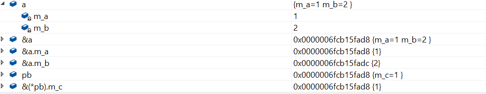

### 指针和引用的区别

1. 非空区别: 任何情况下都不能使用指向空值的引用，一个引用必须总是指向某些对象。 指针可以指向空。
2. 合法性区别: 引用在使用之前不需要测试合法性，指针应该总是要被测试，防止其为空
3. 可修改性区别: 引用在初始化时指定对象，以后不能修改。

### 指针传递动态内存

**例1: 程序测试后会有什么结果？**

```cpp
#include<iostream>
#include<cstring>
using namespace std;

void getMemory(char*p, int num)
{
    p = (char*)malloc(sizeof(char) * num);
}

int main(int argc, const char* argv[])
{
    char *str = NULL;
    getMemory(str, 100);
    strcpy(str, "hello");
    return 0;
}
```

问题出现在`getMemory`里，编译器总是为函数的每个参数制作一个临时副本。在本题中，p为str的拷贝，p申请了一个新的内存空间，但是并没有影响到str，str还是NULL，再调用strcpy(), 则会使代码崩溃，并且p申请的内存也一直没用释放，造成内存泄露。

正确的方法是把往getMemory内传入str的地址。

```cpp
#include<iostream>
#include<cstring>
using namespace std;

void getMemory(char**p, int num)
{
    *p = (char*)malloc(sizeof(char) * num);
}

int main(int argc, const char* argv[])
{
    char *str = NULL;
    getMemory(&str, 100);
    strcpy(str, "hello");
    cout << str << endl;
    return 0;
}
```

不过这样写有些麻烦，我们可以直接把申请好的内存返回。

```cpp
#include<iostream>
#include<cstring>
using namespace std;

char* getMemory(int num)
{
    return (char*)malloc(sizeof(char) * num);
}

int main(int argc, const char* argv[])
{
    char *str = NULL;
    str = getMemory(100);
    strcpy(str, "hello");
    cout << str << endl;
    return 0;
}
```

**例2: 这个函数有什么问题?**

```cpp
char* strA()
{
    char str[] = "hello world";
    return str;
}
```

str里存的地址是函数strA栈帧里`"hello world"`的首地址，函数调用完成，临时空间被重置。

如果要获得正确的函数，可以这样写：

```c
char* strA()
{
    char *str = "hello world";
    return str;
}
```
首先要搞清楚`char str[]`, `char* str`, 

`char str[]` 分配的是一个局部数组，

`char* str` 分配的是一个指针遍历，

局部数组是局部变量，它对应的是内存中的栈。指针变量是全局变量，它对应的是内存中的全局区域。

不过上述代码只能c语言这么写，c++不允许 

`ISO C++ forbids converting a string constant to ‘char*’`

可以这么写：

```cpp
char* strA()
{
    static char str[] = "hello world";
    return str;
}
```

**例3: 下面代码的输出结果是什么？**

```cpp
#include<iostream>
using namespace std;

class A
{
public:
    A() { m_a = 1; m_b = 2; }
    ~A(){}
    void fun() { printf("%d%d", m_a, m_b);}
private:
    int m_a;
    int m_b;
};

class B
{
public:
    B() {m_c = 3;}
    ~B();
    void fun() {printf("%d", m_c);}
private:
    int m_c;
};


int main(int argc, const char* argv[])
{
    A a;
    B *pb = (B*)(&a);
    pb->fun();
    return 0;
}
```
这道题的目的就是考察你对内存偏移的理解，

`B* pb = (B*)(&a);`, 这是一个野蛮的转换，强制把a地址内容看成一个B类的对象，pb指向的是a类的内存空间, 把a类空间按照B类的结构来解读。




### 函数指针

**例1: 找出下列程序的错误**

```cpp
#include<iostream>
using namespace std;

int Max(int x, int y)
{
	return x > y ? x : y;
}

int main(int argc, char const *argv[])
{
	int *p = &Max;
	cout << p(2, 1) << endl;
	return 0;
}
```

这道程序提存在着函数指针的错误使用问题，正确的写法为: `int (*p)(int, int) = &Max;`


`int *p`	p 是int 型的指针

`int *p(int, int)`, p是一个函数，返回值为`int*`

`int (*p)(int, int)`, p是一个指针，指向函数的地址，函数的返回值为int

