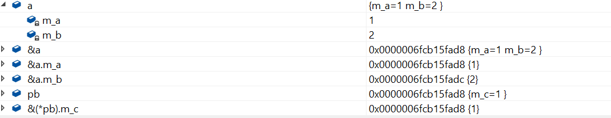

### 1. 以下代码的输出结果是什么？

```cpp
int main(int argc, const char* argv[])
{
    int x = 2, y, z;
    x *= (y=z=5); cout << x << endl;
    z = 3;
    x == (y=z); cout << x << endl;
    x = (y == z); cout << x << endl;
    x = (y & z); cout << x << endl;
    y = 4;
    x = (y | z); cout << x << endl;
    x = (y || z); cout << x << endl;
    return 0;
}
```

```cpp
int main(int argc, const char* argv[])
{
    int x = 2, y, z;
    x *= (y=z=5); cout << x << endl;  // x = x * y;  x = 2 * 5;  10
    z = 3;
    x == (y=z); cout << x << endl;  // x == y; x 没变， x = 10;
    x = (y == z); cout << x << endl;  // y == z; 为真，x = 1;
    x = (y & z); cout << x << endl;  // x = (3 按位与 3); x = 3;
    x = (y && z); cout << x << endl;  // x = (3 与 3); x = 1;
    y = 4;
    x = (y | z); cout << x << endl;  // x = (4 按位或 3); x = 7;
    x = (y || z); cout << x << endl;  // x = (4 或 3); x = 1;
    return 0;
}
```

### 2. 以下代码的输出结果是什么？

```cpp
int func(int x)
{
    int count = 0;
    while (x) {
        ++count;
        x = x & (x - 1);
    }
    return count;
}


int main(int argc, const char* argv[])
{
    cout << func(9999) << endl;
    return 0;
}

```


### 3. 以下代码的输出结果是什么？

```cpp
#include<cstdio>

int main(int argc, const char* argv[])
{
    int b = 3;
    int arr[] = {6,7,8,9,10};
    int* ptr = arr;
    *(ptr++) += 123;
    printf("%d %d\n", *ptr, *(++ptr));
    return 0;
}
```


```cpp
#include<cstdio>

int main(int argc, const char* argv[])
{
    int b = 3;
    int arr[] = {6,7,8,9,10};
    int* ptr = arr;  // ptr 指向6的地址
    *(ptr++) += 123;  // 等价于 *ptr += 123; ptr++; arr的值为 {129，7，8，9，10}，ptr指向7
    printf("%d %d\n", *ptr, *(++ptr));  // printf从右往左压栈，++ptr, ptr 指向8的位置，输出 8 8
    return 0;
}
```

### 4. 以下代码的输出结果是什么？

```cpp
#include<cstdio>


int main(int argc, const char* argv[])
{
    unsigned int a = 0xFFFFFFF7;
    unsigned char i = (unsigned char) a;
    char* p = (char*)&a;
    printf("%08x %08x", i, *p);
    return 0;
}
```

在x86系列的cpu中，使用的是小端模式，低地址放数据的地位，F7放在第一个字节的位置，所以`unsigned int a = 0x000000F7`, p 指向 a的地址，由于 p是有符号char类型，所以`*p`的值为0xFFFFFFF7,
    
内存里存放的是数据的补码。 所以输出： 000000F7, fffffff7

### 5. 以下程序测试会有什么结果？

```cpp
#include<iostream>
#include<cstring>
using namespace std;

void getMemory(char*p, int num)
{
    p = (char*)malloc(sizeof(char) * num);
}

int main(int argc, const char* argv[])
{
    char *str = NULL;
    getMemory(str, 100);
    strcpy(str, "hello");
    return 0;
}
```

问题出现在`getMemory`里，编译器总是为函数的每个参数制作一个临时副本。在本题中，p为str的拷贝，p申请了一个新的内存空间，但是并没有影响到str，str还是NULL，再调用strcpy(), 则会使代码崩溃，并且p申请的内存也一直没用释放，造成内存泄露。

正确的方法是把往getMemory内传入str的地址。

```cpp
#include<iostream>
#include<cstring>
using namespace std;

void getMemory(char**p, int num)
{
    *p = (char*)malloc(sizeof(char) * num);
}

int main(int argc, const char* argv[])
{
    char *str = NULL;
    getMemory(&str, 100);
    strcpy(str, "hello");
    cout << str << endl;
    return 0;
}
```

不过这样写有些麻烦，我们可以直接把申请好的内存返回。

```cpp
#include<iostream>
#include<cstring>
using namespace std;

char* getMemory(int num)
{
    return (char*)malloc(sizeof(char) * num);
}

int main(int argc, const char* argv[])
{
    char *str = NULL;
    str = getMemory(100);
    strcpy(str, "hello");
    cout << str << endl;
    return 0;
}
```

### 6. 这个函数有什么问题?

```cpp
char* strA()
{
    char str[] = "hello world";
    return str;
}
```

str里存的地址是函数strA栈帧里`"hello world"`的首地址，函数调用完成，临时空间被重置。

如果要获得正确的函数，可以这样写：

```c
char* strA()
{
    char *str = "hello world";
    return str;
}
```
首先要搞清楚`char str[]`, `char* str`, 

`char str[]` 分配的是一个局部数组，

`char* str` 分配的是一个指针遍历，

局部数组是局部变量，它对应的是内存中的栈。指针变量是全局变量，它对应的是内存中的全局区域。

不过上述代码只能c语言这么写，c++不允许 

`ISO C++ forbids converting a string constant to ‘char*’`

可以这么写：

```cpp
char* strA()
{
    static char str[] = "hello world";
    return str;
}
```

### 7. 以下代码的输出结果是什么？

```cpp
#include<iostream>
using namespace std;

int main(int argc, const char* argv[])
{
    int a[3];
    a[0] = 0; a[1] = 1; a[2] = 2;
    int *p, *q;
    p = a;
    q = &a[2];
    cout << a[q-p] << endl;
    return 0;
}
```

`q-p`的实际运算是：(q的地址 - p的地址) / sizeof(int)),

`8 / 4 = 2`

答案为2


### 8. 下面代码的输出结果是什么？

```cpp
#include<iostream>
using namespace std;

class A
{
public:
    A() { m_a = 1; m_b = 2; }
    ~A(){}
    void fun() { printf("%d%d", m_a, m_b);}
private:
    int m_a;
    int m_b;
};

class B
{
public:
    B() {m_c = 3;}
    ~B();
    void fun() {printf("%d", m_c);}
private:
    int m_c;
};


int main(int argc, const char* argv[])
{
    A a;
    B *pb = (B*)(&a);
    pb->fun();
    return 0;
}
```
这道题的目的就是考察你对内存偏移的理解，

`B* pb = (B*)(&a);`, 这是一个野蛮的转换，强制把a地址内容看成一个B类的对象，pb指向的是a类的内存空间, 把a类空间按照B类的结构来解读。




### 9. 下列程序的输出结果是什么？

```cpp
#include<iostream>
using namespace std;

class A
{
public:
    int _a;
    A() { _a = 1;}
    void print() { printf("%d\n", _a);}
};

class B : public A
{
public:
    int _a;
    B(){ _a = 2; }
};


int main(int argc, char const *argv[])
{
    B b;
    b.print();      
    printf("%d ", b._a);
    return 0;
}
```